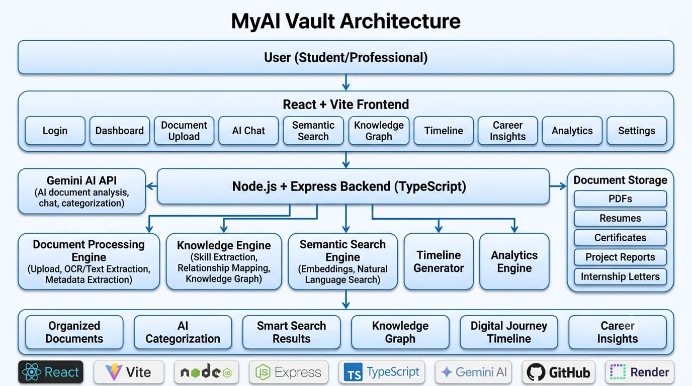

# MyAI Vault

An AI-powered Digital Identity System developed for the **MemoryVerse AI '26 Hackathon**.

## Live Deployment Link

https://myai-vault.onrender.com/

# 📄 Project Documents

## 📄 Thought Process Sheet

[📘 View Thought Process Sheet](./MyAI_Vault_Thought_Process_Sheet.pdf)

## 🏗 AI Architecture Diagram



## 📌 About the Project

MyAI Vault is a smart platform that helps students organize and manage their academic and professional documents in one place.

Instead of simply storing files, the system uses AI to understand uploaded documents, categorize them, connect related information, and make retrieval quick and easy.

## ✨ Features

- Upload academic and professional documents
- Automatic document categorization
- AI-powered document understanding
- Smart search functionality
- Digital journey timeline
- User-friendly dashboard
- Responsive design

## 🛠️ Tech Stack

### Frontend
- React
- Vite
- Tailwind CSS

### Backend
- FastAPI (Planned)

### AI Technologies
- NLP
- OCR
- Embeddings
- Semantic Search
- Vector Database (Planned)

## 📂 Project Structure

```
myai-vault/
├── public/
├── src/
├── package.json
├── vite.config.js
└── README.md
```

## 🚀 Getting Started

### Clone the Repository

```bash
git clone https://github.com/YOUR_USERNAME/myai-vault.git
```

### Navigate to the Project

```bash
cd myai-vault
```

### Install Dependencies

```bash
npm install
```

### Run the Project

```bash
npm run dev
```

The application will run at:

```
http://localhost:5173
```

## 🎯 Future Enhancements

- AI Chat Assistant
- Knowledge Graph
- Career Insights
- Resume Analyzer
- Vector Database Integration
- RAG-based Semantic Search

## 👩‍💻 Developed By

**Mahisa S**

AI & Data Science Student

## 🏆 Hackathon

Built for **MemoryVerse AI '26**.
